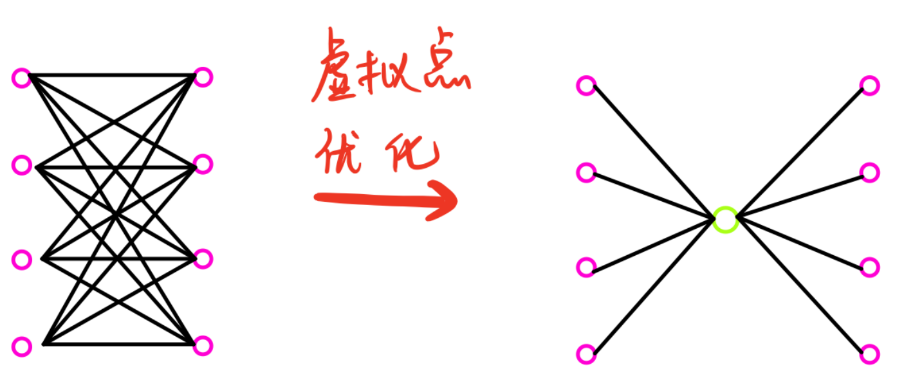

> 值得思考的一种建图优化方式



```c++
#include <iostream>
#include <cstring>

using namespace std;

const int N = 2010, M = 1000010; //1000个虚拟点
int n, m;
int h[N], e[M], w[M], ne[M], idx;
bool st[N];
int din[N], q[N];
int dist[N];

void add(int a, int b, int c) {
    e[idx] = b, w[idx] = c, ne[idx] = h[a], h[a] = idx++;
    ++din[b];
}
void topsort() {
    int hh = 0, tt = -1;
    for (int i = 1; i <= n + m; ++i)
        if (din[i] == 0) 
            q[++tt] = i;
    while (hh <= tt) {
        int t = q[hh++];
        for (int i = h[t]; ~i; i = ne[i]) {
            int j = e[i];
            if (--din[j] == 0)
                q[++tt] = j;
        }
    }
}
int main() {
    memset(h, -1, sizeof h);
    cin >> n >> m;
    for (int i = 1; i <= m; ++i) {
        memset(st, 0, sizeof st); //统计区间内车站有没有停靠
        int it, start = n, end = 1;
        cin >> it;
        for (int j = 0; j < it; ++j) {
            int stop;
            cin >> stop;
            start = min(start, stop);
            end = max(end, stop);
            st[stop] = true;
        }
        //到目前位置，所有st中是true的代表停靠的站
        //停靠的站的优先级 >= 未停靠的站 + 1
        //以此构成差分约束，建图
        int ver = n + i; //虚拟点的建图优化
        for (int j = start; j <= end; ++j) {
            if (st[j]) add(ver, j, 1);
            else add(j, ver, 0);
        }
    }
    topsort();
    for (int i = 1; i <= n; ++i) dist[i] = 1;
    //m个虚拟点 + n个原始点
    for (int i = 0; i < n + m; ++i) {
        int j = q[i];
        for (int k = h[j]; ~k; k = ne[k]) {
            int t = e[k];
            dist[t] = max(dist[t], dist[j] + w[k]);
        }
    }
    int res = 0;
    for (int i = 1; i <= n; ++i) res = max(res, dist[i]);
    cout << res << endl;
    return 0;
}
```