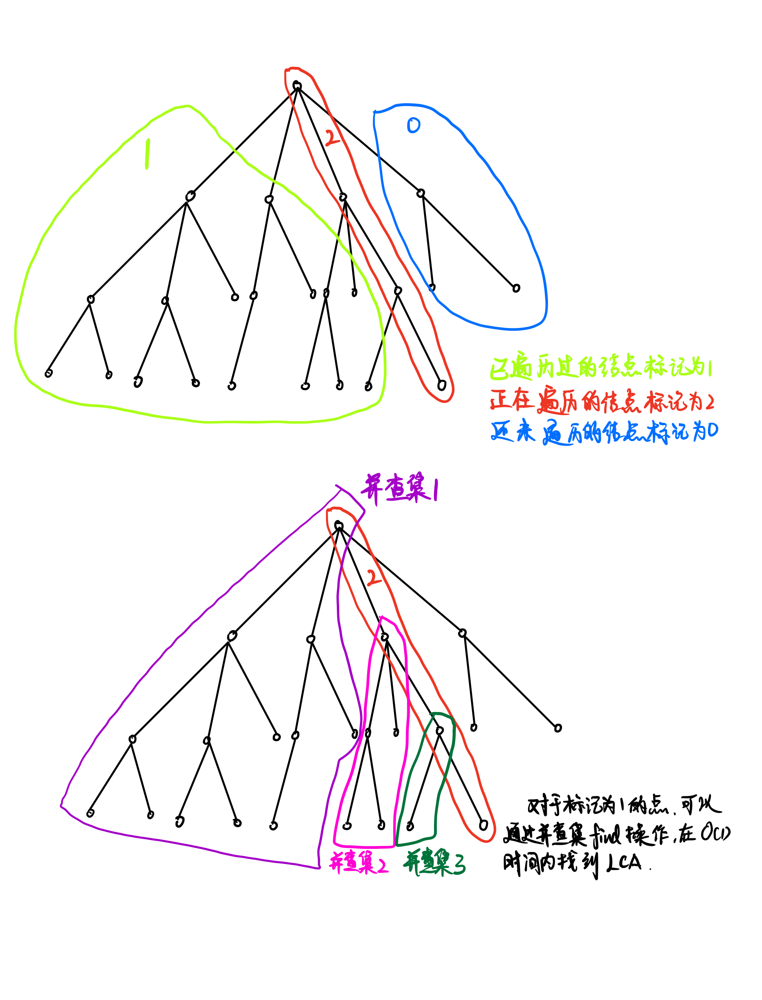

## **LCA最近公共祖先**

### **1. 向上标记法 $O(n)$**

### **2. 倍增**

`fa[i,j]`表示从 $i$ 开始，向上走 $2^j$ 步所能走到的节点。 $(0 \le j \le \log n)$

`depth[i]`表示深度

`哨兵`：如果从 $i$ 开始跳 $2^j$ 步会跳过根节点，那么 `fa[i][j] = 0`。`depth[0] = 0`

`步骤`：
1. 先将两个点调到同一层。
2. 让两个点同时往上跳，一直跳到它们的最近公共祖先的下一层。

预处理 $O(n\log n)$
查询   $O(\log n)$

### **3. Tarjan —— 离线求LCA** $O(n + m)$

在`深度优先遍历`的时候，把所有点分为三大类：
【1】`已经遍历`过，`且回溯`的点
【2】`正在`搜索的点
【3】`还未`搜索的点




-----------------------
##  AcWing 1172. 祖孙询问
#### Code
```c++
#include <iostream>
#include <cstring>

using namespace std;

const int N = 4e4 + 10, M = 2 * N;
int n, m;
int h[N], e[M], ne[M], idx;
int q[N];
int fa[N][16];
int depth[N];

void add(int a, int b) {
    e[idx] = b, ne[idx] = h[a], h[a] = idx++;
}
void bfs(int root) {
    //从根节点开始bfs
    //预处理出所有节点的depth[]和跳跃fa[][]
    memset(depth, 0x3f, sizeof depth);
    depth[0] = 0, depth[root] = 1;  //depth[0]是哨兵
    
    int hh = 0, tt = 0;
    q[0] = root;
    
    while (hh <= tt) {
        int t = q[hh++];
        for (int i = h[t]; ~i; i = ne[i]) {
            int j = e[i];
            if (depth[j] > depth[t] + 1) {    //第一次被更新到，必定是被他的父节点更新的
                depth[j] = depth[t] + 1;
                q[++tt] = j;
                fa[j][0] = t;   //向上走一步，就是父节点
                for (int k = 1; k <= 15; ++k) { //2^16 = 65536，超过了数据范围，15刚好
                    fa[j][k] = fa[fa[j][k - 1]][k - 1]; //走两次2^k-1就是一次2^k
                }
            }
        }
    }
}
int lca(int a, int b) {
    //先走到同一层
    if (depth[a] < depth[b]) swap(a, b);
    for (int i = 15; i >= 0; --i) {
        if (depth[fa[a][i]] >= depth[b]) {
            a = fa[a][i];
        }
    }
    if (a == b) return a;
    //当前a与b在同一层了，开始一起往上找父节点
    for (int i = 15; i >= 0; --i) {
        //当a和b的父节点不相同时，说明还没找到
        //这里用父节点来判断最近公共祖先
        //如果是用 a!=b，就很难判断是不是最近的
        if (fa[a][0] != fa[b][0]) {
            a = fa[a][i];
            b = fa[b][i];
        }
    }
    return fa[a][0];
}
int main() {
    int root;
    memset(h, -1, sizeof h);
    scanf("%d", &n);
    for (int i = 0; i < n; ++i) {
        int a, b;
        scanf("%d%d", &a, &b);
        if (b == -1) root = a;
        add(a, b), add(b, a);
    }
    bfs(root);
    scanf("%d", &m);
    while (m--) {
        int a, b;
        scanf("%d%d", &a, &b);
        int p = lca(a, b);
        if (p == a) puts("1");
        else if (p == b) puts("2");
        else puts("0");
    }
    return 0;
}
```